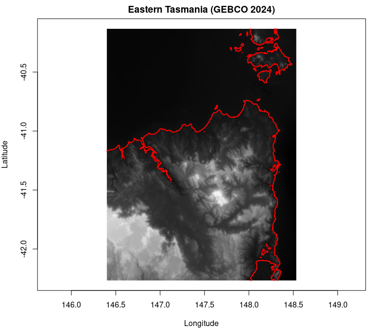
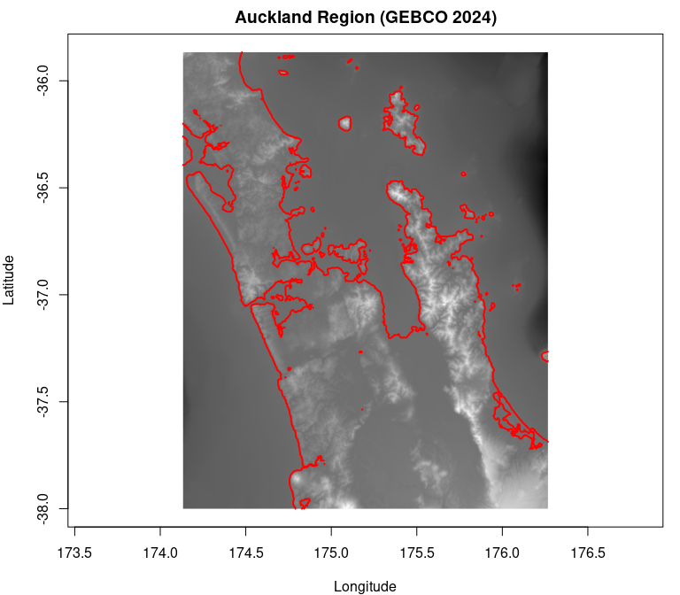

# gdalblock

<!-- badges: start -->

<!-- badges: end -->

gdalblock provides block-based access to GDAL raster datasets using S7.
It wraps `gdalraster::GDALRaster` and exposes the native tiling (block)
structure of raster files, making it easy to read and work with data one
block at a time.

## Installation

You can install gdalblock from GitHub with:

``` r
# install.packages("pak")
pak::pak("hypertidy/gdalblock")
```

gdalblock requires gdalraster \>= 2.4.0.9073 which is installed from
GitHub automatically.

Please note that a lot of the S7 implementation is a bit garbled and
will change.

## Why blocks?

Raster files are stored internally as tiles (blocks). Cloud-optimized
GeoTIFFs (COGs) and many other formats use this structure for efficient
partial reads. gdalblock exposes this structure directly so you can:

- Read exactly one block of data at a time
- Know the dimensions and spatial extent of each block
- Process large rasters block-by-block without loading everything into
  memory
- Work with remote datasets (via `/vsicurl/`) efficiently

GDAL 3.13 has a new vrt:// connection syntax that can read blocks
directly with a concise syntax `vrt://myfile.tif?block=0,0`. The design
here of the `read_block()` matches that syntax exactly and provides the
same functionality but with a richer context of much more information.

## Basic usage

``` r
library(gdalblock)

# Open a remote dataset - GEBCO 2024 global bathymetry
dsn <- "/vsicurl/https://projects.pawsey.org.au/idea-gebco-tif/GEBCO_2024.tif"
b <- gdalblock(dsn)

# Print shows key properties including block structure
b
#> gdalblock object
#>  DSN      : /vsicurl/https://projects.pawsey.org.au/idea-gebco-tif/GEBCO_2024.tif 
#>  Dim      : 86400, 43200, 1 
#>  Res      : 0.004167, 0.004167 
#>  Bbox     : -180.000000, -90.000000, 180.000000, 90.000000 
#>  Datatype : Int16 
#>  Blocks   : 512 x 512 (169 x 85 blocks) 
#>  Edges    : right=384, bottom=192 
#>  CRS      : GEOGCS["WGS 84",
#>                DATUM["WGS_1984",
#>                    SPHEROID["WGS 84",6378137,298.257223563,
#>                        AUTHORITY["EPSG","7030"]],
#>                    AUTHORITY["EPSG","6326"]],
#>                PRIMEM["Greenwich",0,
#>                    AUTHORITY["EPSG","8901"]],
#>                UNIT["degree",0.0174532925199433,
#>                    AUTHORITY["EPSG","9122"]],
#>                AXIS["Latitude",NORTH],
#>                AXIS["Longitude",EAST],
#>                AUTHORITY["EPSG","4326"]]
```

## Properties

Access dataset properties using `@`:

``` r
# Dataset description (file path or URL)
b@dsn
#> [1] "/vsicurl/https://projects.pawsey.org.au/idea-gebco-tif/GEBCO_2024.tif"

# Dimensions: columns, rows, bands
b@dimension
#>   ncol   nrow nbands 
#>  86400  43200      1

# Resolution
b@res
#>        xres        yres 
#> 0.004166667 0.004166667

# Bounding box: xmin, ymin, xmax, ymax
b@bbox
#>      xmin ymin.nrow xmax.ncol      ymax 
#>      -180       -90       180        90

# Number of bands
b@nbands
#> [1] 1

# Data type per band
b@datatype
#> [1] "Int16"

# Block size (standard tile dimensions)
b@blocksize
#>  width height 
#>    512    512

# Number of blocks in x and y
b@nblocks
#>  nx  ny 
#> 169  85

# Full block structure including edge block sizes
b@blocks
#> $size
#>  width height 
#>    512    512 
#> 
#> $count
#>  nx  ny 
#> 169  85 
#> 
#> $edge_width
#> [1] 384
#> 
#> $edge_height
#> [1] 192
```

The `blocks` property shows that edge blocks (rightmost column, bottom
row) may be smaller than the standard block size.

## Reading blocks

Blocks are indexed from 0 (following GDAL convention). Use
`read_block(x, i, j)` where `i` is the column index and `j` is the row
index:

``` r
# Read the top-left block
m <- read_block(b, 0, 0)
dim(m)
#> [1] 512 512
class(m)
#> [1] "matrix" "array"

# Read an edge block (bottom-right corner)
m_edge <- read_block(b, b@nblocks[1] - 1, b@nblocks[2] - 1)
dim(m_edge)  # Smaller dimensions due to edge effects
#> [1] 192 384
```

## Block metadata

Get information about a specific block without reading the data:

``` r
# Block dimensions (may differ for edge blocks)
block_dim(b, 0, 0)
#> ncol.xsize nrow.ysize 
#>        512        512
block_dim(b, 168, 84)  # Edge block
#> ncol.xsize nrow.ysize 
#>        384        192

# Block bounding box in dataset coordinates
block_bbox(b, 0, 0)
#>  xmin.xoff  ymin.yoff  xmax.xoff  ymax.yoff 
#> -180.00000   87.86667 -177.86667   90.00000

# Pixel/line offsets (for use with GDAL read operations)
block_index(b, 0, 0)
#>  xoff  yoff xsize ysize 
#>     0     0   512   512
```

## Example: Plotting a region

Here’s how to find a block covering a specific location and plot it.
We’ll map Tasmania:

``` r
library(gdalblock)

dsn <- "/vsicurl/https://projects.pawsey.org.au/idea-gebco-tif/GEBCO_2024.tif"
b <- gdalblock(dsn)

# Tasmania is roughly at 147°E, 42°S
# Calculate which block contains this location
target_lon <- 147
target_lat <- -42

# Block indices (0-based)
i <- floor((target_lon - b@bbox[1]) / (b@blocksize[1] * b@res[1]))
j <- floor((b@bbox[4] - target_lat) / (b@blocksize[2] * b@res[2]))
cat("Block indices:", i, j, "\n")
#> Block indices: 153 61

# Read the block
m <- read_block(b, i, j)

# Get block extent for plotting
bb <- block_bbox(b, i, j)
xlim <- c(bb[1], bb[3])
ylim <- c(bb[2], bb[4])

# Scale data to 0-1 for RGB display
m_scaled <- (m - min(m)) / (max(m) - min(m))
rgb_array <- array(m_scaled, dim = c(dim(m), 3))

# Plot
par(mar = c(4, 4, 2, 1))
plot(NULL, xlim = xlim, ylim = ylim, asp = 1 / cos(mean(ylim) * pi / 180),
     xlab = "Longitude", ylab = "Latitude", main = "Eastern Tasmania (GEBCO 2024)")

# rasterImage uses same orientation as read_block - no flip needed
rasterImage(rgb_array, xlim[1], ylim[1], xlim[2], ylim[2])

# Add coastline contour at 0m (sea level)
# contour() needs ascending y values, so we flip the matrix
x_seq <- seq(xlim[1], xlim[2], length.out = ncol(m))
y_seq <- seq(ylim[2], ylim[1], length.out = nrow(m))  # Descending (image order)
y_seq_asc <- rev(y_seq)

contour(x_seq, y_seq_asc, t(m[nrow(m):1, ]), levels = 0, 
        add = TRUE, col = "red", lwd = 2, drawlabels = FALSE)
```



## Try another location: Auckland

``` r
# Auckland is roughly at 175°E, 37°S
target_lon <- 175
target_lat <- -37

i <- floor((target_lon - b@bbox[1]) / (b@blocksize[1] * b@res[1]))
j <- floor((b@bbox[4] - target_lat) / (b@blocksize[2] * b@res[2]))
cat("Block indices:", i, j, "\n")
#> Block indices: 166 59

m <- read_block(b, i, j)
bb <- block_bbox(b, i, j)
xlim <- c(bb[1], bb[3])
ylim <- c(bb[2], bb[4])

m_scaled <- (m - min(m)) / (max(m) - min(m))
rgb_array <- array(m_scaled, dim = c(dim(m), 3))

par(mar = c(4, 4, 2, 1))
plot(NULL, xlim = xlim, ylim = ylim, asp = 1 / cos(mean(ylim) * pi / 180),
     xlab = "Longitude", ylab = "Latitude", main = "Auckland Region (GEBCO 2024)")

rasterImage(rgb_array, xlim[1], ylim[1], xlim[2], ylim[2])

x_seq <- seq(xlim[1], xlim[2], length.out = ncol(m))
y_seq <- seq(ylim[2], ylim[1], length.out = nrow(m))
y_seq_asc <- rev(y_seq)

contour(x_seq, y_seq_asc, t(m[nrow(m):1, ]), levels = 0, 
        add = TRUE, col = "red", lwd = 2, drawlabels = FALSE)
```



## Accessing the underlying GDALRaster object

If you need full access to the gdalraster API, the underlying
`GDALRaster` object is available:

``` r
# Access the GDALRaster object
b@ds
#> C++ object of class GDALRaster
#>  Driver : GeoTIFF (GTiff)
#>  DSN    : /vsicurl/https://projects.pawsey.org.au/idea-gebco-tif/GEBCO_2024.tif
#>  Dim    : 86400, 43200, 1
#>  CRS    : WGS 84 (EPSG:4326)
#>  Res    : 0.004167, 0.004167
#>  Bbox   : -180.000000, -90.000000, 180.000000, 90.000000

# Use gdalraster methods directly
b@ds$getDriverShortName()
#> [1] "GTiff"
b@ds$getMetadata(band = 0, domain = "IMAGE_STRUCTURE")
#> [1] "LAYOUT=COG"          "COMPRESSION=DEFLATE" "INTERLEAVE=BAND"
```

## Related packages

- [gdalraster](https://github.com/firelab/gdalraster) - The underlying
  GDAL bindings
- [terra](https://github.com/rspatial/terra) - Full-featured raster
  analysis
- [grout](https://github.com/hypertidy/grout) - Tiling logic

gdalblock is intentionally minimal - it focuses on exposing block
structure for efficient partial reads, particularly useful for
cloud-optimized formats and remote data access.
